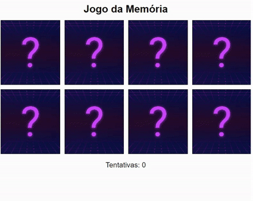

# Jogo da memória

Projeto desenvolvido em HTML,CSS e Java Script. O site desenvolvido é um jogo da memória online. Para as imagens, foi consumida a API Picsum, para assim sempre ter diferentes imagens nos cards.

🔗 [Click here to access](https://n4ju15.github.io/jogo_da_memoria/)

## Tecnologias

- HTML
- CSS
- JavaScript
- Git and Github

